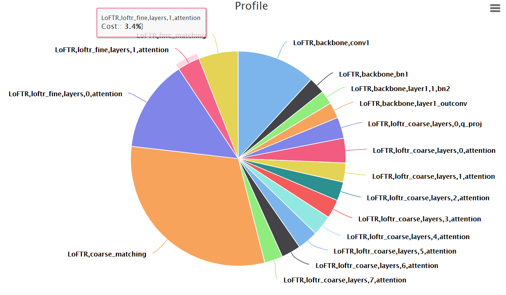

# LoFTR Profile
### [Project Page](https://github.com/zju3dv/LoFTR) | [Paper](https://arxiv.org/pdf/2104.00680.pdf)

# Torchprof guidance
```shell
Pleace follow the author's guidance: https://github.com/awwong1/torchprof
```

# Drawing tools： HighCharts
```shell
#For the profile only
pip install python-highcharts
```
# Record the time spent on each layer in an xlsx table
```shell
# Inference with LoFTR and get profile with xlsx
with torch.no_grad():
    with torchprof.Profile(matcher, use_cuda=True, profile_memory=True) as prof:
        matcher(batch)
    print(prof)
    result = ""
    result += prof.display()
    trace, event_lists_dict = prof.raw()
    run_time = 1 #set the time threshold(ms) to filter the layers running longer than threshold
    result += "\n\nThe layers cost longer than %dms: \n" % run_time
    for i in range(0,len(trace)):
        if len(event_lists_dict[trace[i].path]):
            if event_lists_dict[trace[i].path][0].self_cpu_time_total>run_time*1000:
                print(trace[i].path)
                result += "%s\t\t\tCost time in CPU:%fms\n" % (str(trace[i].path),(event_lists_dict[trace[i].path][0].self_cpu_time_total/1000))
                #result += "%s\n" % str(event_lists_dict[trace[i].path][0]) #show the details of these costy modules
        else:
            i+=1
    #pdb.set_trace()
    excel = open("../LoFTR/profile.xlsx", "w").write(result)
```
    
# Set a time threshold and draw a pie chart of the layers above this threshold
```shell
#draw a pie
    run_time_pie = 0.5 #set the pie-chart time threshold(ms)
    H = Highchart(width=850,height=500)
    Pai_dic = {}
    data = []  # 各个值，影响各个扇形的面积
    for i in range(0, len(trace)):
        if len(event_lists_dict[trace[i].path]):
            if event_lists_dict[trace[i].path][0].self_cpu_time_total > run_time_pie * 1000:
                Pai_dic['id'] = i
                Pai_dic['name'] = trace[i].path
                Pai_dic['y'] = event_lists_dict[trace[i].path][0].self_cpu_time_total
                Pai_dic['colors'] = 'Highcharts.getOptions().colors[%d]' % i
                data.append(Pai_dic)
                data = deepcopy(data)
    #pdb.set_trace()
    options = {
        'title':{
            'text': 'Profile'
        },
        'tooltip':{
            'pointFormat': '{series.name}: <b>{point.percentage:.1f}%</b>}'
        },
        'plotOptions':{
            'pie': {
                'allowPointSelect': True,  # 允许某个区块选择后弹出来
                'cursor': 'pointer',
            }
        }
    }
    H.set_dict_options(options)
    H.add_data_set(data, 'pie', "Cost:")
    H.save_file('LoFTR_Profile')
```

